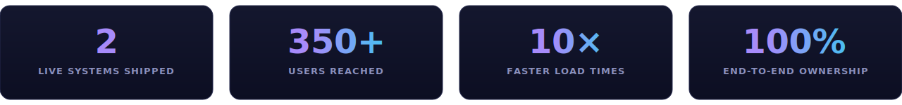

<!-- ====================== HERO ====================== -->
<div align="center">



<br/>

<a href="https://www.linkedin.com/in/ronaudemarrobles"></a>


<br/><br/>


</div>

<!-- ====================== INTRO ====================== -->

> I take the slow, outdated, hours-eating systems a business runs on and rebuild them into
> something **fast, smooth, and modern**. Legacy web apps, manual workflows, and tangled stacks —
> rewritten clean. From the database to the pixel, one person owns every layer.

<div align="center"></div>

<!-- ====================== WHAT I BUILD ====================== -->

## ⚙️ &nbsp; What I build

<table>
<tr>
<td width="33%" valign="top">

### `›` Rebuilt legacy systems
Slow, aging stacks rewritten into clean, maintainable code that loads in a blink. Same business logic, a fraction of the wait — and none of the duct tape.

</td>
<td width="33%" valign="top">

### `›` Full-stack & SaaS
Web apps that run a real business: ordering, inventory, dashboards, role-based access. Live and in use, not a portfolio demo. Next.js, Supabase, TypeScript.

</td>
<td width="33%" valign="top">

### `›` Workflow automation
The manual, copy-paste work between your tools, replaced with software that moves data on its own. n8n, Make, and custom OpenAI &amp; Claude integrations.

</td>
</tr>
</table>

<div align="center"></div>

<!-- ====================== HOW IT WORKS ====================== -->

## 🧭 &nbsp; How I work

```text
  ① Audit              ② Rebuild             ③ Launch
  ──────────           ──────────            ──────────
  Find what's          Rewrite it fast,      Ship it smooth,
  slow & outdated      clean & modern        tested & reliable
```

**Old, sluggish system  →  ⚡  →  fast, smooth, modern web.**

<div align="center"></div>

<!-- ====================== SELECTED WORK ====================== -->

## 🚀 &nbsp; Selected work

> _Placeholder entries — swap in your real projects, numbers, and links._

**🏚️ Foreclosed-property intelligence pipeline**
Pulls listings out of bank PDFs, scores and ranks them, enriches each with location imagery and comparable sales, then generates ready-to-post listings on a schedule. Turned an hours-per-week manual grind into a system that runs itself.

**📦 Distribution management SaaS**
Full-stack platform handling inventory, ordering, and reporting for a distributor. Auth, role-based access, and real-time dashboards. Replaced spreadsheets and manual reordering for a live operation.

**🧩 Chrome extensions (350+ users)**
Browser tools shipped to a real user base, including a YouTube transcript extractor. Manifest V3, fully client-side, 350+ active installs.

**🎯 Lead-prospecting engine**
Scrapes local businesses and scores them against a weakness rubric to surface high-fit outreach targets. Fully automated in TypeScript.

<div align="center"></div>

<!-- ====================== STACK ====================== -->

## 🛠️ &nbsp; Stack

<div align="center">

**Languages**


**Frontend**


**Backend & Data**


**AI & Automation**


**Ship**


</div>

<div align="center"></div>

<!-- ====================== IMPACT ====================== -->

## ⚡ &nbsp; By the numbers

<div align="center">



<sub>Placeholder figures — edit <code>assets/impact.svg</code> with your real numbers.</sub>

</div>

<div align="center"></div>

<!-- ====================== CTA ====================== -->

## 📡 &nbsp; Let's build

<div align="center">

**Got an outdated system slowing you down? Let's turn it into one that runs itself.**

Taking on freelance and contract builds now. Best fit: founders and teams stuck on slow, manual, legacy systems.

<br/>

<a href="https://www.linkedin.com/in/ronaudemarrobles"></a>
<a href="https://www.linkedin.com/in/ronaudemarrobles"></a>

<br/><br/>

<sub><code>$ ./aude --status</code> &nbsp; rebuilding outdated systems &nbsp; · &nbsp; fast, smooth, modern</sub>

</div>
